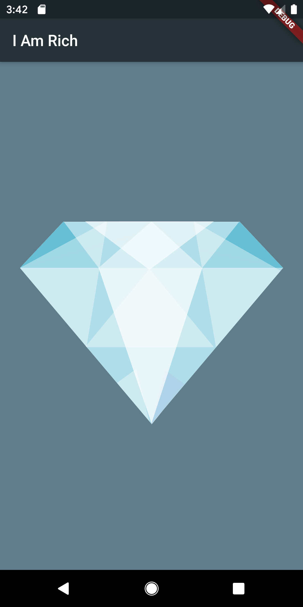

# i_am_rich

My first flutter application from the training at [appbrewery](https://www.appbrewery.co/p/flutter-development-bootcamp-with-dart)

Highlights
----

+ Setting up environment (Flutter, Android Studio, XCode, Simulators and Android Device)
+ Creating a new Flutter project
+ Running on iOS simulator and real android device
+ Scaffolding a material app, displaying text and learning about Widget tree
+ Displaying Image using NetworkImage, AssetImage
+ The pubspec file for configuring dependencies and assets location
+ App Icons and how to update for both Android and iOS

Screenshots
-----

